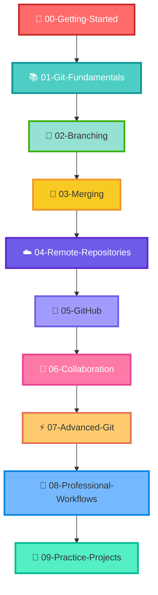

# 🎯 How to Use This Repository

<div align="center">

```
╔══════════════════════════════════════════════════════════════╗
║                                                              ║
║          🌟 Welcome to Your Git Mastery Journey! 🌟          ║
║                                                              ║
╚══════════════════════════════════════════════════════════════╝
```


</div>

---

## 🎭 Why This Repository Exists

<table>
<tr>
<td width="50%">

### ❌ Traditional Approach
```bash
git add
git commit
git push
```
**Result:** Forgotten in days ⏰

</td>
<td width="50%">

### ✅ Our Approach
```
Commands + Context + Practice
```
**Result:** Mastery for life 🏆

</td>
</tr>
</table>

> 💡 **Key Insight:** We don't just teach commands—we teach **workflows** and **real-world application**!

---

## 🗺️ Your Learning Roadmap



<div align="center">

⚠️ **Important:** Follow the sequence! Each topic builds on previous knowledge.

</div>

---

## 🎓 The Proven Learning Method

<details open>
<summary><b>📖 Step-by-Step Process (Click to expand)</b></summary>

<br>

| Step | Action | Icon | Duration |
|------|--------|------|----------|
| 1️⃣ | **Read** the notes carefully | 📚 | 10 min |
| 2️⃣ | **Understand** the concept | 🧠 | 5 min |
| 3️⃣ | **Run** commands yourself | ⌨️ | 10 min |
| 4️⃣ | **Experiment** with examples | 🔬 | 15 min |
| 5️⃣ | **Make** intentional mistakes | 💥 | 10 min |
| 6️⃣ | **Fix** those mistakes | 🔧 | 10 min |

<div align="center">

```
┌─────────────────────────────────────────┐
│  🎯 Total Practice Time: ~60 minutes   │
│     Perfect for daily learning! ⏰      │
└─────────────────────────────────────────┘
```

</div>

</details>

---

## 🧪 Create Your Practice Laboratory

<div align="center">

### 🔬 Git Playground Setup

</div>

```bash
# 🏗️ Build your learning environment
mkdir git-playground
cd git-playground
git init

# 🎉 You're ready to experiment!
```

<table>
<tr>
<td width="33%" align="center">

<br><b>Experiment Freely</b>
<br>Create & delete files
</td>
<td width="33%" align="center">

<br><b>Break Things</b>
<br>Cause merge conflicts
</td>
<td width="33%" align="center">

<br><b>Fix & Learn</b>
<br>Solve problems
</td>
</tr>
</table>

> 🎪 **Pro Tip:** The more you break here, the less you'll break in production!

---

## 💻 Perfect Learning Environment

<div align="center">

```
╔════════════════════════════════════════════════╗
║                                                ║
║  📄 Documentation    │    💻 Terminal          ║
║  ─────────────────   │   ─────────────────    ║
║                      │                         ║
║  Read Concept   ────→│─→  Run Command         ║
║       ↓              │         ↓               ║
║  Understand     ←────│←─  See Output          ║
║                                                ║
╚════════════════════════════════════════════════╝
```

</div>

### 🔄 The Learning Loop

```
┌──────────────┐
│ Read Concept │
└──────┬───────┘
       ↓
┌──────────────┐
│ Run Command  │
└──────┬───────┘
       ↓
┌──────────────┐
│ Observe      │
└──────┬───────┘
       ↓
┌──────────────┐
│ Experiment   │
└──────┬───────┘
       ↓
┌──────────────┐
│ Understand   │
└──────────────┘
```

---

## 🧠 Smart Learning (Not Memorization)

<div align="center">

| ❌ Don't Do This | ✅ Do This Instead |
|------------------|-------------------|
| Memorize commands | Understand **why** it exists |
| Rush through topics | Practice **slowly** |
| Skip fundamentals | Build **strong foundation** |
| Just read | **Experiment** actively |

</div>

### 🤔 Ask These Questions

```
┏━━━━━━━━━━━━━━━━━━━━━━━━━━━━━━━━━━━━━━┓
┃ 🎯 What problem am I solving?        ┃
┃ 🔍 Why does this command exist?      ┃
┃ 📊 What happens after I run it?      ┃
┃ 🔄 How does it affect my workflow?   ┃
┗━━━━━━━━━━━━━━━━━━━━━━━━━━━━━━━━━━━━━━┛
```

---

## 📜 Master Commit History

<div align="center">

### 🔍 Your Most Important Command

</div>

```bash
git log --oneline --graph --all --decorate
```

<table>
<tr>
<td>

**📊 Why This Matters:**
- 🕰️ Understand project timeline
- 🔍 Debug issues faster
- 👥 See team contributions
- 📚 Learn from past decisions

</td>
<td>

```
* a1b2c3d (HEAD -> main) Add feature
* d4e5f6g Update docs
* g7h8i9j Fix bug
* j0k1l2m Initial commit
```

</td>
</tr>
</table>

---

## 🆘 When You Get Stuck

<div align="center">

### 🎯 Common Challenge Zones

</div>

<table>
<tr>
<td align="center">⚡<br><b>Staging Area</b></td>
<td align="center">🌿<br><b>Branching</b></td>
<td align="center">🔀<br><b>Merging</b></td>
</tr>
<tr>
<td align="center">💥<br><b>Conflicts</b></td>
<td align="center">🔄<br><b>Rebase</b></td>
<td align="center">☁️<br><b>Remotes</b></td>
</tr>
</table>

<div align="center">

```
╔════════════════════════════════════════╗
║                                        ║
║   🚫 DON'T PANIC!                      ║
║                                        ║
║   ✅ Re-read the notes                 ║
║   ✅ Run commands again                ║
║   ✅ Experiment more                   ║
║   ✅ It will "click"!                  ║
║                                        ║
╚════════════════════════════════════════╝
```

</div>

---

## 📅 Your Study Routine

### 🌅 Daily Practice (30 minutes)

<details>
<summary><b>📋 Daily Checklist (Click to expand)</b></summary>

<br>

- [ ] 📖 Learn **one** topic thoroughly
- [ ] ⌨️ Practice for 20-30 minutes
- [ ] 💾 Create a few commits
- [ ] 🔄 Review what you learned
- [ ] 📝 Take notes on key insights

</details>

### 📊 Weekly Project (1-2 hours)

<details>
<summary><b>🎯 Weekly Goals (Click to expand)</b></summary>

<br>

```
Week 1: 🏗️  Basic repository operations
Week 2: 🌿  Branching workflows
Week 3: 🔀  Merging strategies
Week 4: ☁️  GitHub collaboration
```

**Activities:**
- 🚀 Build a small project
- 🌿 Create & merge branches
- 👥 Simulate collaboration
- ☁️ Push to GitHub

</details>

<div align="center">

```
┌─────────────────────────────────────┐
│  🎯 Remember:                       │
│  Consistency > Speed                │
│  Practice > Theory                  │
│  Building > Reading                 │
└─────────────────────────────────────┘
```

</div>

---

## 🎯 Progress Milestones

<div align="center">

### ✅ You're Making Progress When...

</div>

| Milestone | Achievement | Status |
|-----------|-------------|--------|
| 🎯 **Level 1** | Create commits without thinking | ⬜ |
| 🎯 **Level 2** | Understand staged vs unstaged | ⬜ |
| 🎯 **Level 3** | Branch & merge confidently | ⬜ |
| 🎯 **Level 4** | Resolve conflicts calmly | ⬜ |
| 🎯 **Level 5** | Push & pull comfortably | ⬜ |
| 🎯 **Level 6** | Explain Git to others | ⬜ |

<div align="center">

```
════════════════════════════════════════
    🏆 Completion Rate: 0/6 Levels
════════════════════════════════════════
```

</div>

---

## 🌟 The Golden Rules

<div align="center">

```
╔══════════════════════════════════════════════════════════╗
║                                                          ║
║  🎯 Git is a TOOL, not a subject                        ║
║                                                          ║
║  🔨 Build projects → Learn naturally                    ║
║                                                          ║
║  💥 Break things → Understand deeply                    ║
║                                                          ║
║  🔧 Fix problems → Gain confidence                      ║
║                                                          ║
║  🔄 Repeat daily → Achieve mastery                      ║
║                                                          ║
╚══════════════════════════════════════════════════════════╝
```

</div>

---

## 🚀 Your Path to Mastery

<table>
<tr>
<td width="25%" align="center">

<br><b>📚 Learn</b>
<br>Understand concepts
</td>
<td width="25%" align="center">

<br><b>🔨 Build</b>
<br>Create projects
</td>
<td width="25%" align="center">

<br><b>💥 Break</b>
<br>Make mistakes
</td>
<td width="25%" align="center">

<br><b>✅ Fix</b>
<br>Solve problems
</td>
</tr>
</table>

---

<div align="center">

```
╔════════════════════════════════════════════════════════════╗
║                                                            ║
║         🎉 Ready to Start Your Journey? 🎉                ║
║                                                            ║
║              Let's Master Git Together!                    ║
║                                                            ║
║                    Happy Learning! 🚀                      ║
║                                                            ║
╚════════════════════════════════════════════════════════════╝
```

<br>


<br>

**⭐ Star this repo if you find it helpful!**

**🔗 Share with fellow learners**

**💬 Questions? Open an issue!**

</div>

---

<div align="center">

### 📚 Quick Navigation

[🏠 Home](.) • [📖 Getting Started](./00-Getting-Started) • [🌿 Branching](./02-Branching) • [🔀 Merging](./03-Merging) • [☁️ GitHub](./05-GitHub)

<br>

*Made with ❤️ for aspiring developers*

[](https://opensource.org/licenses/MIT)

</div>