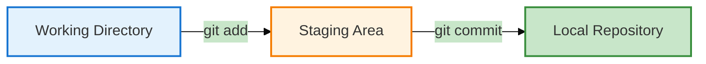
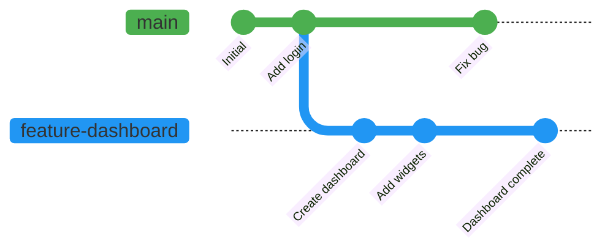
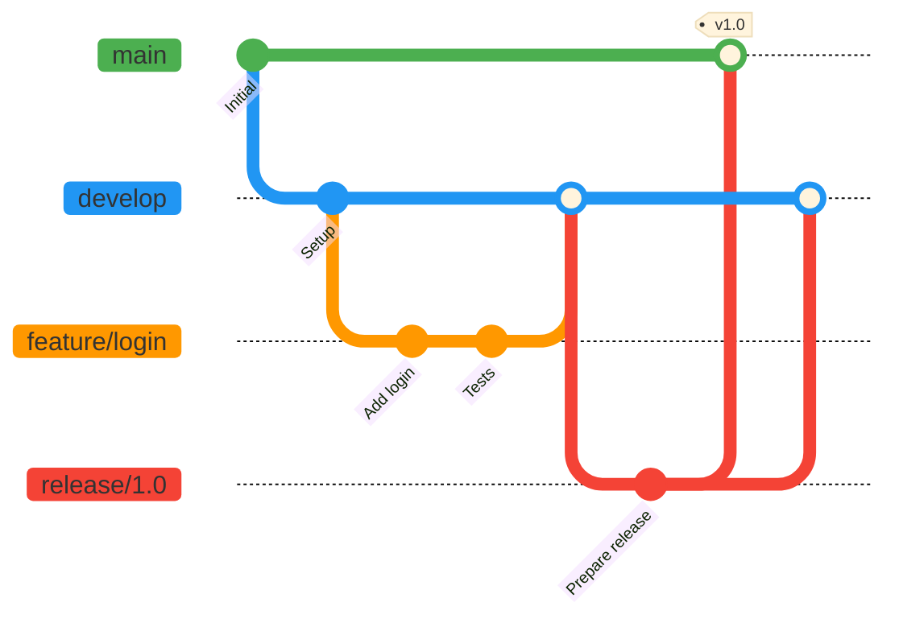

<div align="center">


<h1>🗺️ Your Complete Git & GitHub Learning Path</h1>
<h3><em>From Zero to Git Hero - A Structured Journey</em></h3>

<br>

  

<br>

<blockquote>
💡 <strong>Core Philosophy:</strong> Learning Git is not about memorizing commands. It's about understanding how developers manage code, collaborate with teams, and safely track changes over time. This roadmap takes you from absolute beginner to a developer who can confidently use Git and GitHub in real-world projects.
</blockquote>

<br>


</div>

<br>

## 📊 Learning Journey Overview

<div align="center">

```mermaid
%%{init: {'theme':'base', 'themeVariables': { 'primaryColor':'#4CAF50','secondaryColor':'#2196F3','tertiaryColor':'#FF9800','lineColor':'#1976D2'}}}%%
graph TB
    Start[🎯 Start Here] --> Phase1[Phase 1: Understanding]
    Phase1 --> Phase2[Phase 2: Fundamentals]
    Phase2 --> Phase3[Phase 3: Git Workflow]
    Phase3 --> Phase4[Phase 4: Recovery]
    Phase4 --> Phase5[Phase 5: Branching]
    Phase5 --> Phase6[Phase 6: Merging]
    Phase6 --> Phase7[Phase 7: GitHub Intro]
    Phase7 --> Phase8[Phase 8: Remote Work]
    Phase8 --> Phase9[Phase 9: Collaboration]
    Phase9 --> Phase10[Phase 10: Advanced]
    Phase10 --> Phase11[Phase 11: Professional]
    Phase11 --> Phase12[Phase 12: Practice]
    Phase12 --> Success[🎊 Git Master!]
    

    style Start fill:#4CAF50,stroke:#2E7D32,stroke-width:3px,color:#fff
    style Success fill:#FF9800,stroke:#F57C00,stroke-width:3px,color:#fff
    style Phase1 fill:#E8F5E9,stroke:#4CAF50,stroke-width:2px
    style Phase2 fill:#E3F2FD,stroke:#2196F3,stroke-width:2px
    style Phase3 fill:#F3E5F5,stroke:#9C27B0,stroke-width:2px
    style Phase4 fill:#FFF3E0,stroke:#FF9800,stroke-width:2px
    style Phase5 fill:#E0F2F1,stroke:#009688,stroke-width:2px
    style Phase6 fill:#FCE4EC,stroke:#E91E63,stroke-width:2px
    style Phase7 fill:#F1F8E9,stroke:#8BC34A,stroke-width:2px
    style Phase8 fill:#E8EAF6,stroke:#3F51B5,stroke-width:2px
    style Phase9 fill:#FFF8E1,stroke:#FFC107,stroke-width:2px
    style Phase10 fill:#EFEBE9,stroke:#795548,stroke-width:2px
    style Phase11 fill:#ECEFF1,stroke:#607D8B,stroke-width:2px
    style Phase12 fill:#E0F7FA,stroke:#00BCD4,stroke-width:2px
  ```

    </div><br>

    <br>

## 🎯 Phase 1: Understanding the Problem Git Solves
<div align="center">  <h3>Before Learning Commands, Understand WHY Git Exists</h3> </div><br><table> <tr> <td width="50%">
## 📚 Topics Covered
<ul> <li>✅ What is Version Control?</li> <li>✅ Why developers need Git</li> <li>✅ Problems Git solves</li> <li>✅ Local vs Remote repositories</li> <li>✅ Git vs GitHub differences</li> <li>✅ Git workflow overview</li> </ul></td> <td width="50%">
🎯 Learning Goal
<br><blockquote>By the end of this phase, you should confidently answer:<br><br><strong>"Why should I use Git instead of manually creating project_v1, project_v2, final_final_v3 folders?"</strong></blockquote><br><table> <tr> <td align="center"><br><strong>Conceptual</strong></td> <td align="center"><br><strong>Reading</strong></td> <td align="center"><br><strong>No Coding</strong></td> </tr> </table></td> </tr> </table><br><details> <summary><strong>📖 Why This Phase Matters (Click to expand)</strong></summary><br>
<strong>The Problem:</strong>

Many developers jump straight into commands without understanding the fundamental problems Git solves. This leads to:

Confusion about when to use Git
Misunderstanding Git's purpose
Poor commit practices
Fear of advanced features
<strong>The Solution:</strong>

Understanding the "why" before the "how" creates a mental framework that makes every subsequent command logical and memorable.

</details><br>
<br>

## 🛠️ Phase 2: Git Fundamentals
<div align="center">  <h3>Start Using Git Locally</h3> </div><br><table> <tr> <td width="50%">
📚 Topics Covered
<ul> <li>✅ Installing Git properly</li> <li>✅ Git Configuration (user.name, user.email)</li> <li>✅ Creating your first repository</li> <li>✅ Tracking files effectively</li> <li>✅ Understanding staging changes</li> <li>✅ Creating meaningful commits</li> <li>✅ Viewing project history</li> </ul></td> <td width="50%">
⌨️ Essential Commands

```Bash

git init          # Initialize repository
git status        # Check repository state
git add           # Stage changes
git commit        # Save checkpoint
git log           # View history
```
<br>
🎯 Learning Goal
<blockquote>You should be able to <strong>create a repository</strong> and <strong>save project checkpoints</strong> using commits independently.</blockquote></td> </tr> </table><br><div align="center">
💡 Hands-On Practice
<table> <tr> <td align="center" width="33%"><br><strong>Create Repo</strong><br><code>git init</code></td> <td align="center" width="33%"><br><strong>Make Changes</strong><br>Edit files</td> <td align="center" width="33%"><br><strong>Save History</strong><br><code>git commit</code></td> </tr> </table></div><br>
<br>
🔄 Phase 3: Understanding the Git Workflow
<div align="center">  <h3>Learn How Git Actually Works Internally</h3> </div><br><blockquote>⚠️ <strong>Critical Phase:</strong> Most beginners learn commands without understanding the workflow. This phase focuses on <strong>how Git actually works</strong> behind the scenes.</blockquote><br>
📚 Topics Covered
<table> <tr> <td width="25%" align="center"><br><strong>Working Directory</strong><br><sub>Your project files</sub></td> <td width="25%" align="center"><br><strong>Staging Area</strong><br><sub>Prepared changes</sub></td> <td width="25%" align="center"><br><strong>Local Repository</strong><br><sub>Saved history</sub></td> <td width="25%" align="center"><br><strong>Commit Lifecycle</strong><br><sub>Complete flow</sub></td> </tr> </table><br>
🎯 Learning Goal
<blockquote>You should understand <strong>what happens internally</strong> when you run:<br><br><code>git add</code> → Moves to staging area<br><code>git commit</code> → Saves to repository<br><br>And <strong>where your changes move</strong> in each step.</blockquote><br><div align="center">


</div><br>


<br>
🔧 Phase 4: Undoing Mistakes
<div align="center">  <h3>Every Developer Makes Mistakes - Learn Recovery Early</h3> </div><br><table> <tr> <td width="50%">
📚 Topics Covered
<ul> <li>✅ Undoing staged changes</li> <li>✅ Restoring deleted files</li> <li>✅ Amending last commit</li> <li>✅ Viewing differences (diff)</li> <li>✅ Recovering lost work</li> <li>✅ Understanding reflog</li> </ul><br>
🎯 Learning Goal
<blockquote>You should be <strong>comfortable fixing common mistakes</strong> without panic or fear of losing work.</blockquote></td> <td width="50%">
⌨️ Recovery Commands

```Bash

git restore         # Undo changes
git diff            # See differences
git commit --amend  # Fix last commit
git reflog          # View all actions
git reset           # Move back in time
```
<br>

💪 Confidence Building

<table> <tr> <td align="center"><br><strong>Make Mistakes</strong></td> <td align="center"><br><strong>Fix Them</strong></td> <td align="center"><br><strong>Build Confidence</strong></td> </tr> </table></td> </tr> </table><br>
<br>
🌿 Phase 5: Branching
<div align="center">  <h3>Where Git Becomes Truly Powerful</h3> </div><br><blockquote>🔥 <strong>Game Changer:</strong> Branching is where Git's real power emerges. Branches allow <strong>multiple versions of a project to exist simultaneously</strong> without interfering with each other.</blockquote><br><table> <tr> <td width="50%">
📚 Topics Covered
<ul> <li>✅ What is a branch?</li> <li>✅ Why use branches?</li> <li>✅ Creating new branches</li> <li>✅ Switching between branches</li> <li>✅ Branch naming conventions</li> <li>✅ Branch workflow strategies</li> <li>✅ Deleting merged branches</li> </ul></td> <td width="50%">
⌨️ Branch Commands

```Bash

git branch           # List branches
git branch <name>    # Create branch
git switch <name>    # Switch branch
git checkout -b      # Create & switch
git branch -d        # Delete branch
```

<br>

🎯 Learning Goal
<blockquote>You should be able to <strong>develop features independently</strong> without affecting the main codebase.</blockquote></td> </tr> </table><br><div align="center">
🌳 Branch Visualization



</div><br>
<br>
🔀 Phase 6: Merging & Conflict Resolution
<div align="center">  <h3>Combining Work Safely</h3> </div><br><blockquote>⚡ <strong>Critical Skill:</strong> Sooner or later, branches must be combined. This phase teaches how teams <strong>integrate work safely</strong> and resolve conflicts professionally.</blockquote><br><table> <tr> <td width="50%">
📚 Topics Covered
<ul> <li>✅ Understanding merge basics</li> <li>✅ Fast-Forward merge</li> <li>✅ Three-Way merge</li> <li>✅ Merge conflicts explained</li> <li>✅ Conflict resolution strategies</li> <li>✅ Merge best practices</li> </ul><br>
🎯 Learning Goal
<blockquote>You should <strong>confidently resolve merge conflicts</strong> instead of fearing them.</blockquote></td> <td width="50%">
⌨️ Merge Commands

```Bash

git merge <branch>   # Merge branch
git status           # Check conflicts
git add              # Mark resolved
git commit           # Complete merge
```
<br>
🛡️ Conflict Resolution
<table> <tr> <td align="center"><br><strong>Before</strong><br><sub>Fear conflicts</sub></td> <td align="center"><br><strong>Learning</strong><br><sub>Understand them</sub></td> <td align="center"><br><strong>After</strong><br><sub>Master them</sub></td> </tr> </table></td> </tr> </table><br>
<br>
🌐 Phase 7: Introduction to GitHub
<div align="center">  <h3>From Local Development to Cloud Collaboration</h3> </div><br><table> <tr> <td width="50%">
📚 Topics Covered
<ul> <li>✅ What is GitHub?</li> <li>✅ GitHub vs Git differences</li> <li>✅ Creating GitHub account</li> <li>✅ Creating repositories on GitHub</li> <li>✅ Cloning repositories</li> <li>✅ Connecting local Git to GitHub</li> <li>✅ README.md best practices</li> </ul></td> <td width="50%">
⌨️ GitHub Commands

```Bash

git clone <url>              # Copy repository
git remote add origin <url>  # Connect to GitHub
git remote -v                # View remotes
```
<br>

🎯 Learning Goal
<blockquote>You should understand how <strong>local repositories connect to GitHub</strong> and why cloud storage matters.</blockquote></td> </tr> </table><br><div align="center">
🔗 Local to Cloud Connection
<table> <tr> <td align="center" width="33%"><br><strong>Local Git</strong><br><sub>Your computer</sub></td> <td align="center" width="33%"><br><strong>Connection</strong><br><sub>Remote URL</sub></td> <td align="center" width="33%"><br><strong>GitHub</strong><br><sub>Cloud storage</sub></td> </tr> </table></div><br>
<br>

🔄 Phase 8: Working with Remote Repositories
<div align="center">  <h3>How Developers Collaborate Daily</h3> </div><br><table> <tr> <td width="50%">
📚 Topics Covered
<ul> <li>✅ Pushing changes to GitHub</li> <li>✅ Pulling updates from team</li> <li>✅ Fetching vs Pulling differences</li> <li>✅ Synchronizing repositories</li> <li>✅ Handling push conflicts</li> <li>✅ Remote branch tracking</li> </ul></td> <td width="50%">
⌨️ Remote Commands

```Bash

git push              # Upload changes
git pull              # Download + merge
git fetch             # Download only
git push -u origin    # Set upstream
```

<br>
🎯 Learning Goal
<blockquote>You should be able to <strong>keep local and remote repositories synchronized</strong> seamlessly.</blockquote></td> </tr> </table><br><div align="center">
🔄 Sync Workflow
<table> <tr> <td align="center" width="25%"><br><strong>1. Make Changes</strong><br><sub>Edit locally</sub></td> <td align="center" width="25%"><br><strong>2. Commit</strong><br><sub>Save locally</sub></td> <td align="center" width="25%"><br><strong>3. Push</strong><br><sub>Upload to GitHub</sub></td> <td align="center" width="25%"><br><strong>4. Pull</strong><br><sub>Get team updates</sub></td> </tr> </table></div><br>
<br>
🤝 Phase 9: Collaboration Workflows
<div align="center">  <h3>Git's True Value: Working with Others</h3> </div><br><blockquote>🌟 <strong>Teamwork Makes the Dream Work:</strong> Git becomes <strong>truly valuable</strong> when working with others. This is where professional development happens.</blockquote><br><table> <tr> <td width="50%">
📚 Topics Covered
<ul> <li>✅ Forking repositories</li> <li>✅ Creating Pull Requests (PRs)</li> <li>✅ Code review process</li> <li>✅ PR best practices</li> <li>✅ Team collaboration patterns</li> <li>✅ Open Source contributions</li> <li>✅ Issue tracking</li> </ul></td> <td width="50%">
🎯 Learning Goal
<blockquote>You should be able to <strong>contribute to another developer's repository</strong> professionally using Pull Requests.</blockquote><br>
🌟 Collaboration Flow
<table> <tr> <td align="center"><br><strong>Fork</strong></td> <td align="center"><br><strong>Change</strong></td> <td align="center"><br><strong>PR</strong></td> <td align="center"><br><strong>Merge</strong></td> </tr> </table></td> </tr> </table><br>
<br>
🚀 Phase 10: Advanced Git
<div align="center">  <h3>Professional Developer Productivity Tools</h3> </div><br><table> <tr> <td width="50%">
📚 Topics Covered
<ul> <li>✅ Git Rebase (Interactive & Regular)</li> <li>✅ Cherry-picking commits</li> <li>✅ Stashing work in progress</li> <li>✅ Creating and using tags</li> <li>✅ Understanding reflog deeply</li> <li>✅ Git reset variations</li> <li>✅ Rewriting history safely</li> </ul></td> <td width="50%">
⌨️ Advanced Commands

```Bash

git rebase           # Rewrite history
git cherry-pick      # Select commits
git stash            # Save WIP
git tag              # Mark versions
git reset            # Move HEAD
git reflog           # View all actions
```

<br>
🎯 Learning Goal
<blockquote>You should understand <strong>advanced workflows and history management</strong> used by professional developers.</blockquote></td> </tr> </table><br><div align="center">
⚡ Power User Tools
<table> <tr> <td align="center" width="25%"><br><strong>Rebase</strong><br><sub>Clean history</sub></td> <td align="center" width="25%"><br><strong>Cherry-pick</strong><br><sub>Select commits</sub></td> <td align="center" width="25%"><br><strong>Stash</strong><br><sub>Save progress</sub></td> <td align="center" width="25%"><br><strong>Tags</strong><br><sub>Mark releases</sub></td> </tr> </table></div><br>
<br>
💼 Phase 11: Professional Git Workflows
<div align="center">  <h3>How Real Teams Manage Production Software</h3> </div><br><table> <tr> <td width="50%">
📚 Topics Covered
<ul> <li>✅ Feature Branch Workflow</li> <li>✅ Git Flow methodology</li> <li>✅ GitHub Flow pattern</li> <li>✅ Release management</li> <li>✅ Hotfix workflow</li> <li>✅ Trunk-based development</li> <li>✅ CI/CD integration basics</li> </ul></td> <td width="50%">
🎯 Learning Goal
<blockquote>Understand how <strong>Git is used in real companies</strong> and large-scale projects with multiple developers.</blockquote><br>
🏢 Enterprise Patterns
<table> <tr> <td align="center"><br><strong>Git Flow</strong></td> <td align="center"><br><strong>GitHub Flow</strong></td> <td align="center"><br><strong>Releases</strong></td> </tr> </table></td> </tr> </table><br><div align="center">
🔄 Git Flow Visualization


</div><br>
<br>
🏗️ Phase 12: Real-World Practice
<div align="center">  <h3>Theory Alone Won't Make You Good at Git</h3> </div><br><blockquote>💪 <strong>The Ultimate Truth:</strong> Build projects and practice workflows. You learn Git by <strong>using it</strong>, not reading about it.</blockquote><br>
🎯 Suggested Practice Projects
<table> <tr> <td width="50%">
🌐 Web Projects
<ul> <li>✅ Personal Portfolio Website</li> <li>✅ Todo Application (Frontend)</li> <li>✅ Blog Platform</li> <li>✅ Weather App</li> </ul>
🖥️ Backend Projects
<ul> <li>✅ REST API Server</li> <li>✅ E-Commerce Backend</li> <li>✅ Authentication System</li> <li>✅ Database Models</li> </ul></td> <td width="50%">
📚 Learning Projects
<ul> <li>✅ Kubernetes Learning Repo</li> <li>✅ DevOps Practice Repository</li> <li>✅ Algorithm Implementations</li> <li>✅ Code Challenges Solutions</li> </ul>
🌟 Open Source
<ul> <li>✅ Fix documentation</li> <li>✅ Add features</li> <li>✅ Report issues</li> <li>✅ Write tutorials</li> </ul></td> </tr> </table><br>
🎮 Practice Scenarios
<div align="center"><table> <tr> <td align="center" width="16%"><br><strong>Create Branches</strong></td> <td align="center" width="16%"><br><strong>Merge Features</strong></td> <td align="center" width="16%"><br><strong>Resolve Conflicts</strong></td> <td align="center" width="16%"><br><strong>Open PRs</strong></td> <td align="center" width="16%"><br><strong>Review Code</strong></td> <td align="center" width="16%"><br><strong>Recover Mistakes</strong></td> </tr> </table></div><br>
🎯 Final Goal
<blockquote>Use Git <strong>naturally and confidently</strong> while building projects, just like professional developers do every day.</blockquote><br>
<br>
🎊 Your Final Destination
<div align="center">  <h3>What You'll Achieve</h3> </div><br><table> <tr> <td width="50%">
✅ Technical Mastery
<ul> <li>✅ Manage project history confidently</li> <li>✅ Work with branches and merges professionally</li> <li>✅ Resolve conflicts without fear</li> <li>✅ Collaborate using GitHub effectively</li> <li>✅ Contribute to Open Source projects</li> <li>✅ Follow professional Git workflows</li> </ul></td> <td width="50%">
🚀 Career Ready
<ul> <li>✅ Use Git in real-world development</li> <li>✅ Work confidently in team environments</li> <li>✅ Handle enterprise-scale repositories</li> <li>✅ Understand CI/CD integration</li> <li>✅ Debug and recover from mistakes</li> <li>✅ Mentor junior developers</li> </ul></td> </tr> </table><br>
<br>
📅 Recommended Learning Schedule
<div align="center">  <h3>Your 7+ Week Journey</h3> </div><br><table> <tr> <th>📅 Week</th> <th>🎯 Focus Area</th> <th>📚 Phases</th> <th>⏱️ Time/Day</th> <th>✅ Milestone</th> </tr> <tr> <td><strong>Week 1</strong></td> <td>Git Fundamentals</td> <td>Phase 1-2</td> <td>1-2 hours</td> <td>Create repos, make commits</td> </tr> <tr> <td><strong>Week 2</strong></td> <td>Workflow & Recovery</td> <td>Phase 3-4</td> <td>1-2 hours</td> <td>Understand workflow, fix mistakes</td> </tr> <tr> <td><strong>Week 3</strong></td> <td>Branching & Merging</td> <td>Phase 5-6</td> <td>1.5-2 hours</td> <td>Master branches, resolve conflicts</td> </tr> <tr> <td><strong>Week 4</strong></td> <td>GitHub & Remote Work</td> <td>Phase 7-8</td> <td>1.5-2 hours</td> <td>Push/pull, sync repositories</td> </tr> <tr> <td><strong>Week 5</strong></td> <td>Collaboration</td> <td>Phase 9</td> <td>2 hours</td> <td>Create PRs, contribute to projects</td> </tr> <tr> <td><strong>Week 6</strong></td> <td>Advanced Git & Workflows</td> <td>Phase 10-11</td> <td>2-3 hours</td> <td>Rebase, professional patterns</td> </tr> <tr> <td><strong>Week 7+</strong></td> <td>Real Projects & Practice</td> <td>Phase 12</td> <td>3-4 hours</td> <td>Build portfolio, contribute OSS</td> </tr> </table><br><div align="center">
💡 Learning Tips
<table> <tr> <td align="center" width="25%"><br><strong>Consistency</strong><br><sub>Daily practice > binge learning</sub></td> <td align="center" width="25%"><br><strong>Hands-On</strong><br><sub>Type every command yourself</sub></td> <td align="center" width="25%"><br><strong>Make Mistakes</strong><br><sub>Breaking things = learning</sub></td> <td align="center" width="25%"><br><strong>Understand Why</strong><br><sub>Concepts > memorization</sub></td> </tr> </table></div><br>
<br><div align="center">
<br><br>

<h2>🎯 Final Words of Wisdom</h2><br><blockquote><h3>"Git is learned by <strong>using it</strong>, not by <strong>reading about it</strong>."</h3></blockquote><br><table> <tr> <td align="center" width="25%"><br><h3>Make Commits</h3><sub>Save your progress daily</sub></td> <td align="center" width="25%"><br><h3>Create Branches</h3><sub>Experiment fearlessly</sub></td> <td align="center" width="25%"><br><h3>Break Things</h3><sub>Mistakes are teachers</sub></td> <td align="center" width="25%"><br><h3>Fix Them</h3><sub>Recovery builds confidence</sub></td> </tr> </table><br><h3>That's how <strong>real developers</strong> learn Git.</h3><br><br>
<a href="../01-Fundamentals/README.md"></a>

<br><br>

<p><strong>Every expert was once a beginner. Your journey starts NOW! 💪</strong></p><br><hr><br><p><strong>Made with ❤️ for aspiring Git masters</strong></p><br>
   

<br></div> ```